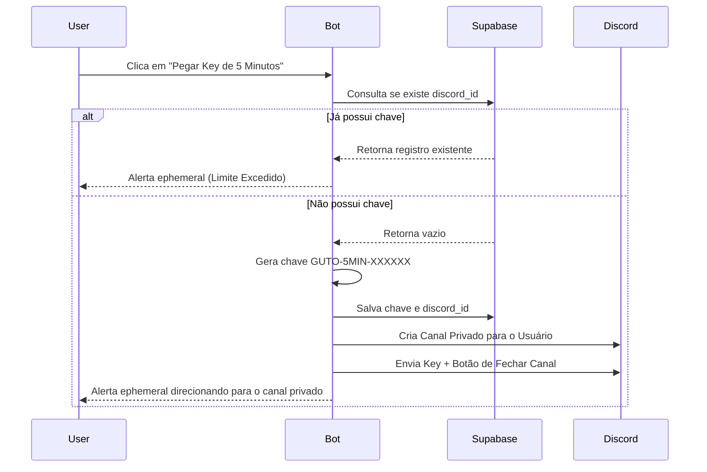

# 🔑 Guto Trial Key - Discord Bot

Este é um bot do Discord feito em Node.js com `discord.js` e integrado ao Supabase para gerenciar a distribuição de chaves (keys) de teste de 5 minutos, limitando a **uma chave por pessoa**.

---

## 🛠️ Pré-requisitos & Instalação

1. **Instalar dependências do projeto:**
   ```bash
   npm install
   ```

2. **Configurar as variáveis de ambiente:**
   Copie o arquivo `.env.example` para `.env` e preencha as variáveis de ambiente necessárias:
   ```bash
   cp .env.example .env
   ```

---

## 🗄️ Configuração do Banco de Dados (Supabase)

O bot está preparado para se conectar a **qualquer** estrutura de tabela existente no seu Supabase através do mapeamento dinâmico de colunas no arquivo `.env`.

### 1. Se você já tem uma tabela de chaves:
Basta preencher as variáveis correspondentes no seu arquivo `.env` para indicar quais colunas correspondem à chave, expiração e ao ID do Discord:
```env
SUPABASE_TABLE=nome_da_sua_tabela
COL_KEY=nome_da_coluna_da_chave
COL_EXPIRATION=nome_da_coluna_de_expiracao
COL_DISCORD_ID=nome_da_coluna_do_discord_id
```

> [!WARNING]
> Para garantir o limite de **1 chave por pessoa**, a tabela que você está utilizando precisa ter uma coluna onde possamos gravar o ID do Discord do usuário que fez o resgate (ex: `discord_id`). Caso seu banco não possua essa coluna, você pode adicioná-la executando a query abaixo no painel SQL do Supabase.

### 2. Se você quiser criar uma tabela nova:
Vá até a aba **SQL Editor** no painel do Supabase e execute a seguinte query SQL:

```sql
-- Criar a tabela de chaves de teste
create table trial_keys (
  id bigint generated always as identity primary key,
  key_value text not null unique,
  discord_id text not null unique,
  created_at timestamp with time zone default timezone('utc'::text, now()) not null,
  expires_at timestamp with time zone not null
);

-- Habilitar leitura rápida usando índices para o ID do Discord
create index idx_trial_keys_discord_id on trial_keys (discord_id);
```

---

## 🤖 Configurando o Bot no Discord Developer Portal

1. Acesse o [Discord Developer Portal](https://discord.com/developers/applications).
2. Crie uma nova aplicação (bot) chamada **Guto Keys** ou o nome de sua preferência.
3. No menu lateral, acesse **Bot**:
   - Resgate o **Token** e cole no campo `DISCORD_TOKEN` do seu arquivo `.env`.
   - Em **Privileged Gateway Intents**, ative as opções:
     - **Presence Intent**
     - **Server Members Intent**
     - **Message Content Intent**
4. No menu lateral, acesse **OAuth2** -> **URL Generator**:
   - Em **Scopes**, marque:
     - `bot`
     - `applications.commands`
   - Em **Bot Permissions**, selecione:
     - `Manage Channels` (Gerenciar Canais)
     - `Send Messages` (Enviar Mensagens)
     - `Embed Links` (Inserir Links)
     - `Read Message History` (Ler Histórico de Mensagens)
5. Copie o link gerado no rodapé da página e use-o para convidar o bot para o seu servidor.
6. Copie o ID da aplicação e cole no campo `DISCORD_CLIENT_ID` no `.env`.
7. No Discord, copie o ID do seu servidor (ativando o Modo Desenvolvedor em Configurações > Avançado) e cole no campo `DISCORD_GUILD_ID` no `.env`.
8. Crie o canal `#support` no seu servidor, copie o ID do canal e cole no campo `SUPPORT_CHANNEL_ID` no `.env`.
9. Adicione as configurações de venda no seu `.env`:
   - `LOVABLE_API_BASE=https://gutopingo.lovable.app`
   - `DISCORD_BOT_SECRET=<segredo_compartilhado_com_site>`
   - `SHOP_CHANNEL_ID=<id_do_canal_de_compras>` (opcional, defaults para o canal onde o comando for executado)

---

## 🚀 Como Executar o Bot

Com todas as variáveis configuradas no `.env` e as dependências instaladas, inicie o bot:

```bash
npm start
```

### ⚙️ Inicializando o Painel de Suporte
Uma vez que o bot esteja rodando e conectado ao seu servidor:
1. Digite o comando `/setup-support` em qualquer canal de texto do servidor.
2. O bot enviará uma mensagem em estilo Embed com o botão **Pegar Key de 5 Minutos** no canal configurado em `SUPPORT_CHANNEL_ID` (ou no canal atual caso não esteja configurado).
3. Pronto! Quando os usuários clicarem no botão, o bot criará um canal temporário e enviará a chave de teste gerada.

### 🛒 Inicializando o Painel de Compras (Sistema de Vendas)
Uma vez que o bot esteja rodando e conectado ao seu servidor:
1. Digite o comando `/setup-shop` em qualquer canal de texto do servidor (apenas administradores).
2. O bot enviará uma mensagem Embed com o título **🛒 GUTO PINGO - Comprar Key** e os botões dos planos (`1 Dia`, `1 Semana`, `30 Dias`, `Vitalício`) no canal configurado em `SHOP_CHANNEL_ID` (ou no canal atual caso não esteja configurado).
3. Quando o usuário clica em um plano:
   - Uma mensagem efêmera é exibida perguntando a forma de pagamento: **PIX** ou **Cartão / PayPal**.
   - O bot faz uma chamada segura para a API do site (`/api/public/bot/create-order`) e retorna o link de pagamento.
   - O bot se inscreve no canal do **Supabase Realtime** para receber a notificação de pagamento confirmado (`status='paid'`).
   - Assim que o webhook do site confirma o pagamento, a key do plano adquirido é gerada, e o bot cria automaticamente um canal privado `compra-<username>` sob a categoria `🛒 COMPRAS`, entregando a chave de licença em formato code block e também enviando via DM.
   - Esse canal privado será auto-deletado após 4 horas ou quando o usuário clicar no botão **Fechar Canal**.

---

## 🔒 Funcionamento do Fluxo


